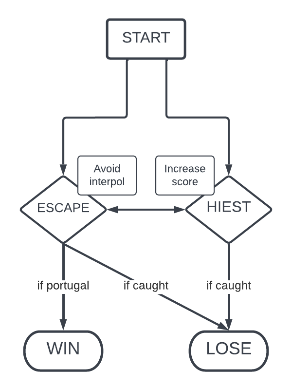
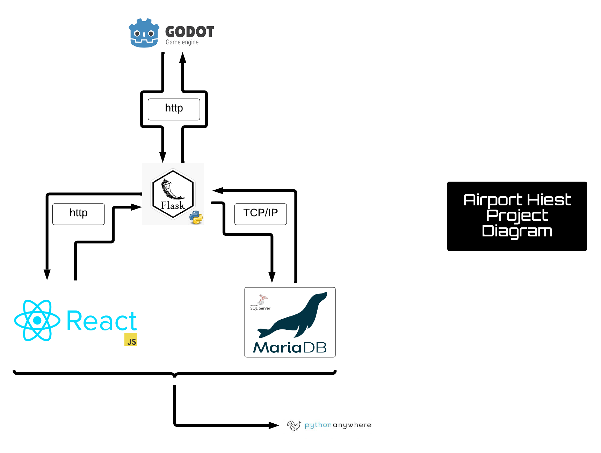

# Airport Heist

    

# Pages

[Airport Heist Webpage](https://Aki78.pythonanywhere.com/Home)

[Presentation slides](https://docs.google.com/presentation/d/1KQzT6HgW3f3YZGUjU3Hmdlt3Ok5fKIw4FlIvdmF3t5Y/edit#slide=id.g166b1584af2_14_1)

## Contents

[Abstract](#abstract)

[Introduction](#introduction)

[Current State](#current-state)

[Vision](#vision)

- [Backstory](#backstory)
- [Setting](#setting)
- [Objective](#objective)

[Functional Requirements](#functional-requirements)

- [How the game works](#how-the-game-works)
- [Decision Tree](#decision-tree)
- [Project diagram](#project-diagram)

[Quality Requirements](#quality-requirements)

- [Preliminary requirements](#preliminary-requirements)
- [Final requirements](#final-requirements-and-goals)

[Learning Tools And Information](#learning-tools-and-information)

- [To Do List](#to-do-list)
- [Project information](#project-info)

## Abstract

This is a first semester group project held in 2022, IT engineering at Metropolia University of Applied Sciences,
by group 3. The goal is to practice groupwork in IT projects by making an online game using git, and 
various full-stack technologies such as python, javascript, sql and related technologies. Our group goal was also to maximise the
learning experience by including extended technologies such as using a game engine and many other useful software to make the game
fun to play and visually pleasing.

## Introduction

This document specifies the design for the gameplay of Airport Heist. The key developers are Aki Morooka, Khai Cao,
Kiana Aghajani, Jenni Hallikas and Francesco Natanni. The Purpose of Airport Heist is to produce a fun and interactive
game, that satisfies the guidelines provided by software1. As well as producing an attractive and intuitive website that
satisfies the requirements of software2. Airport Heist is suitable for all ages.

## Current State

Our game and website are currently fully functional. 
Website features:

* create a profile(stores user data in database)
* log in and out of their profile(calls upon database)
* compete against other users for the highest score(update player's info in the database)
* view top ten highest scores(calls on database)
* view a tutorial on how to play
* view live weather in cities they may be flying to in the game
* view details about development team and contact

## Vision

### Backstory

You are a master thief, captured by the Finnish authorities on the minor charge of jaywalking.
They have no idea of your true genius though and neglect to watch over you properly.
You make a daring, yet surprisingly easy escape from Jokela Prison and are now on the run!
You need to get out of Finland A.S.A.P though as the finnish authorities will stop at nothing to bring you to justice.

Due to your expert skills you are able to steal 5,000€ from the Alepa at Helsinki Airport and commandeer a small plane.
The police, however, have been alerted of your activities and are hot on your tail.
Make it to the extraction point in portugal before interpol finds you!

### Setting

Airport Heist is set in present-day Europe.

### Objective

Your mission is to get to your extraction team, who are waiting for you in portugal, so they can smuggle you out of
the EU.

### How the game works

Airport Heist is a single player game, where the main character aims to make it to the destination airport, before they are captured or their money runs out.

The main character starts the game with 5000€. Each flight cost money based on how long the flight is. Money is equal 
to points, so when the player reaches portugal their score is equal to how much money they have left. In order to 
get more money, and therefore points, players may choose to steal.

#### Travel

The main character starts in Helsinki, Finland and must end up in Portugal. Due to the size of the plane's fuel tank
flights are limited to 800km. Players are shown the airports, with-in their 800km travel range, on a map. They must
decide their flight path themselves.

#### Evading Capture

Players can see in which city interpol is and must avoid flying to the same airport. Interpol moves from airport
to airport at random and in real time. Players must make their decisions quickly. The game is over if interpol lands 
in the same airport as the player.

#### Stealing 

Stealing is done after a player arrives at a new airport. By clicking on the current airport after arriving at it, the player starts a mini-game. 

By winning the mini game the player will win extra money. Interpol is still moving live as the user plays, so keep an eye on them.

If the player loses the mini game, there will be no reward, but instead an extra interpol will appear. Each time the player loses a mini game, a new interpol will spawn. The more interpol moving around the hard it will be to get to your extraction point in portugal.

[Back to top](#airport-heist)

### Decision Tree

The decision tree below show all possible decisions the player can make and the benefits of each.

    

[Back to top](#airport-heist)

## Functional Requirements

[Back to top](#airport-heist)

### Project Diagram

This diagram shows how our different files interact with each other. At the moment we are using Godot, a game
engine to run our game, python to run our backend, react for our website and SQL to store the game's data.

    

[Back to top](#airport-heist)

## Quality Requirements

#### Preliminary Requirements

All helper functions created were ran through pytest to ensure proper working order.
The database was cut down, to remove a lot of unnecessary information and to make calling upon the database faster.

#### Further Development Ideas/Visions

* Interpol  will be trained with machine learning.
* Improve the user experience.
* Enhance the aesthetic of the site.
* mobile freindly version

[Back to top](#airport-heist)

## To-Do-List

### Khai

- [x] js react
- [x] js user login
- [x] js create user account
- [ ] flask user login with password
- [x] js embedding Web Assembly (optional)

### Kiana

- [x] html/css leader board
- [x] html/css tutorial page
- [x] html/css make mobile friendly
- [ ] html/css/js add night-mode option (optional)
- [ ] html/css/js progress graph (optional)

### Frank

- [x] flask API's leader board
- [x] flask create user account
- [x] flask fetching weather
- [ ] flask document API's (optional)

### Jenni

- [x] SQL leaderboard
- [x] SQL users
- [x] SQL update airport DB
- [x] SQL set up DB could
- [ ] SQL user settings DB (optional)
- [ ] SQL play history (optional)

### Aki

- [x] godot game logic / dialog
- [x] godot make real time strategy
- [x] flask set up python cloud
- [ ] godot better map (optional)
- [ ] godot machine learn AI (optional)

### All

- [x] set up server
- [ ] make presentation
- [ ] make charts
- [ ] update documentation
- [ ] test final game

[Back to top](#airport-heist)

### Project Info

[Project Requirements GitHub](https://github.com/vesavvo/Python_Ohjelmistoteema/tree/main/English/Project)
