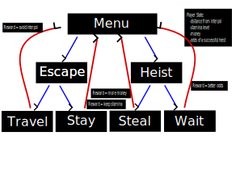
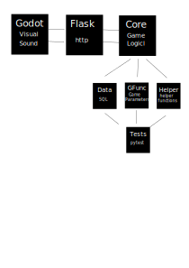

# Airport Heist


<p align="center">
    
</p>


## Contents
[Introduction](#introduction)

[Vision](#vision)

[Story](#story)

[Functional Requirements](#functional-requirements)

[Quality Requirements](#quality_requirements)

[Learning Tools And Information](#learning-tools-and-information)


## Introduction
This document specifies the design for the gameplay of Airport Heist.
The key developers are Aki Morooka, Khai cao, Kiana Aghajani and Francesco Natanni.

## Vision
The Purpose of Airport Heist is to produce a fun and interactive game, 
that satisfies the guidelines provided by software1.

## Story
### Backstory
You are a master thief, captured by the Finnish authorities on the minor charge of jaywalking.
They have no idea of your genius though and neglect to watch over you properly.
You make a daring, yet surprisingly easy escape from Jokela Prison and are now on the run! 
You need to get out of Finland A.S.A.P though as the finnish authorities will stop at nothing to bring you to justice. 
Due to your expert skills you are able to steal 10,000€ from the Alepa at Helsinki Airport. 
The police, however, have been alerted of your activities and are hot on your tail.
Time to make your next move before interpol gets you!

### Setting
Airport Heist is set in present day Europe.

## Functional Requirements
### How the game works
Airport Heist is a single player game, 
where the main character aims to avoid capture from interpol.
Players can fly to different cities with-in europe as long as they can afford the tickets.

Stealing

In order to acquire money to buy tickets players steal, however, there is a chance of getting caught.
Players are informed of the odds of capture before they attempt a heist 
and can abort if they feel the risks are too great. Players have 5 attempts to steal. 
If they use all 5 attempts before escaping, they will be caught and the game is over.
The players stolen earnings are based on gauss' theory with two different expectation values,
depending on the game difficulty selected.

Travel

Travel is possible with the purchase of a flight ticket.
Players are also restricted to airports with-in a certain distance, which is dependent on the game difficulty selected.
Players a shown  list of countries with-in their range.

Evading Capture

Players can see in which city interpol is but not exactly where interpol will go next.
Players will see a choice of 3 possible airports interpol will be in next.
Interpol moves from airport to airport at random. 
Players are limited by their budget and stamina but can steal money to survive.
Players start in Helsinki, Finland and the game ends when they are either caught by interpol or run out of money.

As the game progresses the player take chances by stealing money to increase their wealth
and then making strategic moves to avoid arrest.


<p align="center">
    
</p>


The user is able to do two things: 
    -choose where they travel to
    -if they wish to rob the airport they are currently in.
Where they travel to is limited by budget and distance.
The success of a robbery is mostly down to luck.
Listed below are all the funtctions that were created for the game:
### core_test Functions
    -init_state
    -run_game

### Helper Functions
    -feet_to_meters
    -meters_to_kilometers
    -get_distances
    -get_possible_flights
    -print_possible_flights
    -print_flight_details
    -deg_to_xy
    -get_min_max_distance

### Database Functions
    -get_new_coordinates
    -get_geo_sirport_info
    -get_airport_name
    -get_coordinates
    -get_datalist

### Decisions
    -mode
    -heist_decision
    -money_heist
    -escape
    -player_airport_selection

### Game Functions
    -theft_success_earnings_gauss
    -theft_success_rate
    -get_ticket_price
    -get_stamina_consumptions
    -interpol_index
    -update_player

### Interpol
    -interpol_position_and_movement
    -update

### Prints
    -print_start
    -print_instructions
    -print_settings
    -print_credits
    -print_player_position
    -print_mainmenu
    -steal_rate_and_decision(the be changed)

### Tests
    -test_feet_to_meters
    -test_meters_to_km
    -test_get_distances

    [Back to top](#airport-heist)
Chapter 3 (Functional requirements) discusses everything the user can do with the game. 
The functional requirements are typically presented as user stories with a role (who), 
action (what), and benefit (why). 
An example of a user story would be "As a player I can choose the next airport from the cities showing on the map, 
so that my electric airplane will move there.". 
The example user story contains a role (player), an action (selecting the next city) 
and a benefit the user can gain by completing the action (moving to the new location). 
There are enough user stories when they together describe all functionality of the game. 
For the flight simulator this probably means dozens of user stories. 
Each user story must be unambiguous and concrete. 
It must be possible to look back at the user stories later to determine whether each planned functionality has been implemented in the software.


<p align="center">
    
</p>

[Back to top](#airport-heist)

## Quality Requirements
The visual for the user experience must be pleasing, motion must be smooth. Loading time must not excede more than a couple seconds on a typical 
laptop computer, and freezes must not occur. The game must run on at least 30 fps. The final product must be accesible online.


All functions created were ran through pytest to ensure proper working order.
We also created a new database from the existing one. 
This removed a lot of unnecessary information and made calling upon the database faster.


## Learning Tools And information
### Run
If you are using Mac/Linux run
```bash
python3 connect_py.py
```

If you are using Windows run
```bash
py -3 connect_py.py
```

Make sure your local user name and password are root and root.
Make sure the sql database name and table names match exactly.

### Useful Git Commands

```bash
git pull (saves from github)

git add . (all files)
git commit -m "discription of changes" (add your changes to local git history)
git push (pushs to the repository)

git rm file_name (removes file_name)

git stash (restore everythiing to last commit)

git status (shows your current git state)

git clone repo_name (when you want to copy a repo and add it your computer)
```

### Project Info
https://github.com/vesavvo/Python_Ohjelmistoteema/tree/main/English/Project

### Unrelated English Presentation on Tesla
https://docs.google.com/presentation/d/1TpIigIBr3PJndSA2aOSsjrBivZLBFT9-3XDx2xj_RbI/edit#slide=id.p


### Useful Bash Commands

```bash
pwd                               takes you to curent directory
cd [name of directory]            change directory
cd ~ 		                  takes you home
cd mouseless	                  takes the path to mouseless if its directly under your home (~this symbol is the same as writing c:/user/murph)
ls 			          list directory and files in the directory
mkdir [name of directory]         makes a directory
touch [name of file]	          creates a file in the current directory 
mv file.txt mouseless	          move file to somewhere
mv file.txt file.py	          renames file from txt to py
cd ..			          .. means back one directory

DANGER COMMANDS
rm file.py		          removes file named (only for files not directory)
rmdir			          removes and empty directory only
rm -r [name of directory] removes directory and everything in it
rm -rf name		          remove recurssive force name of directoty
rm *				  this will delete all files only! so make sure youre in the right directory
rm -r * 			  deletes everything in directory including other directories
rm -r *4*			  deletes everything that has a 4 in it
find . -name "*3*.py"	          find files with 3 and .py in it
find . -name "*3*.py" -delete	  find files with 3 and .py in it and then deletes it
cat main.py						  will print out whats inside the file

control-c			  stop command
py -3 filename.py		  runs python program that is in the file in your terminal (windows only)
python3 filename.py		  runs python program that is in the file in your terminal (linux/Mac)

grep -r [expression]              finds the file where the expression exists
```
[Back to top](#airport-heist)