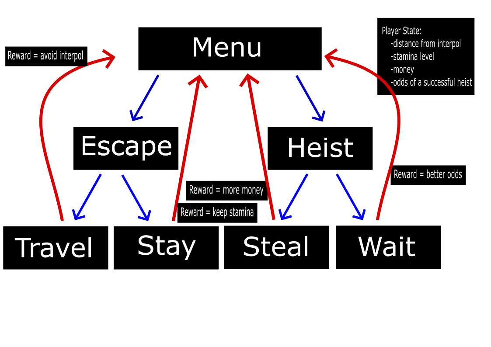
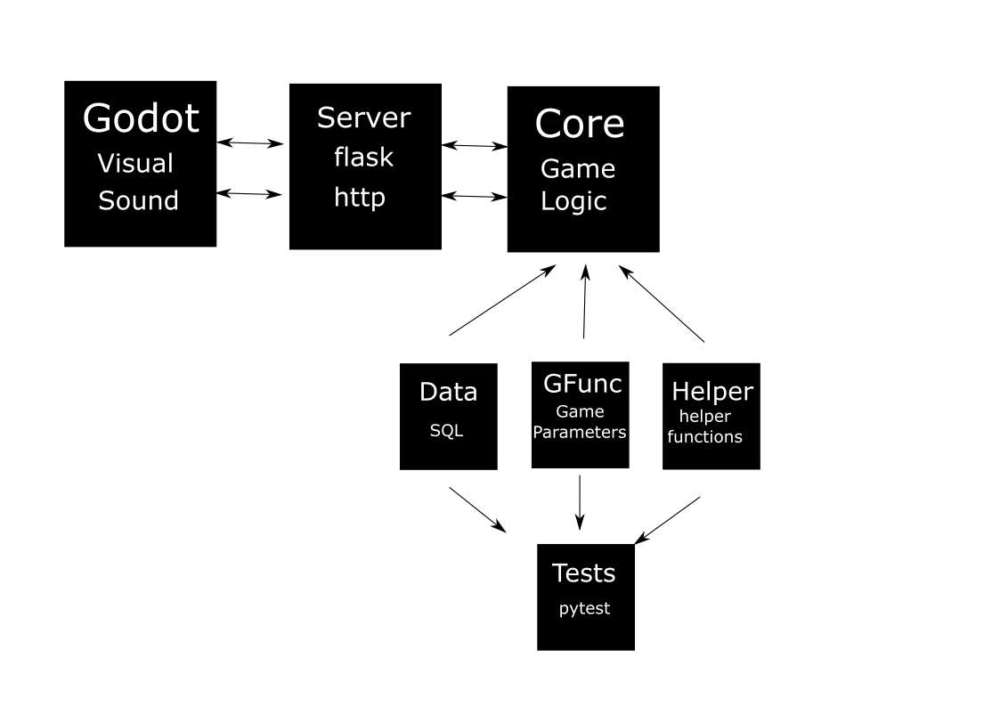

8# Airport Heist


<p align="center">
    
</p>

# Page
https://Aki78.github.io/airport-heist.github.io


## Contents
[Introduction](#introduction)

[Vision](#vision) 
- [Backstory](#backstory)
- [Setting](#setting)
- [Objective](#objective)

[Functional Requirements](#functional-requirements)
- [How the game works](#how-the-game-works)
- [Block diagram](#block-diagram)
- [Functions](#functions)
- [Project diagram](#project-diagram)

[Quality Requirements](#quality-requirements)
- [Preliminary requirements](#preliminary-requirements)
- [Final requirements](#final-requirements-and-goals)

[Learning Tools And Information](#learning-tools-and-information)
- [Airport Heist Presentation](#airport-heist-presentation)
- [Run](#run)
- [Useful git commands](#useful-git-commands)
- [Useful bash commands](#useful-bash-commands)
- [Project information](#project-info)
- [Unrelated English project](#unrelated-english-presentation-on-tesla)

## Introduction
This document specifies the design for the gameplay of Airport Heist. The key developers are Aki Morooka, Khai cao, Kiana Aghajani and Francesco Natanni. The Purpose of Airport Heist is to produce a fun and interactive game, that satisfies the guidelines provided by software1.

## Vision
#### Backstory
You are a master thief, captured by the Finnish authorities on the minor charge of jaywalking.
They have no idea of your genius though and neglect to watch over you properly.
You make a daring, yet surprisingly easy escape from Jokela Prison and are now on the run! 
You need to get out of Finland A.S.A.P though as the finnish authorities will stop at nothing to bring you to justice. 

Due to your expert skills you are able to steal 10,000€ from the Alepa at Helsinki Airport. 
The police, however, have been alerted of your activities and are hot on your tail.
Time to make your next move before interpol gets you!

#### Setting
Airport Heist is set in present-day Europe.

#### Objective
Your mission is to get to your extraction team who are waiting at the destination airport so they can smuggle you out of the EU.


[Back to top](#airport-heist)

## Functional Requirements
### How the game works
Airport Heist is a single player game, where the main character aims to make it to the destination airport, before they are captured, their stamina runs out or money runs out.

#### Travel

The main character start in Helsinki, Finland and must end up in the destination airport provided by the game. Travel is possible with the purchase of flight tickets. Players are shown a list of countries which they can travel to.

#### Evading Capture

Players can see in which city interpol is and a list of airports interpol may be at next.
Interpol moves from airport to airport at random, whenever the player makes a decision in the game. 

#### Stamina

Stamina is a set amount of energy that the main character has for travelling. Each time the main character travels they use up stamina. Stamina does not regenerate, so you must make it to your final destination before it runs out completely.

#### Stealing

The main character starts the game with a set amount of money. If the player requires more money they need to heist. There is, however, a chance of getting caught. Players are informed of the odds of capture before they attempt a heist and can abort if they feel the risks are too great. Players have 5 attempts to steal. If they use all 5 attempts before escaping, they will be caught and the game is over.

[Back to top](#airport-heist)

### Block Diagram
 The decision tree below show all possible decisions the player can make and the benefits of each. 


<p align="center">
    
</p>

[Back to top](#airport-heist)


### Project Diagram
This diagram shows how our different python files interact with each other. At the moment we are using Godot, a game engine, but in the future we will create our user interface through javascript.

<p align="center">
    
</p>

[Back to top](#airport-heist)

## Quality Requirements
#### Preliminary Requirements
All helper functions created were ran through pytest to ensure proper working order.
The database was cut down, to remove a lot of unnecessary information and to make calling upon the database faster.

#### Final Requirements and Goals

    -create scoring system
    -save top 10 players in a database
    -visually pleasing user interface
    -smooth animated motion
    -short start-up time
    -30fps
    -no freezing
    -the game will be in real time, instead of turn-based
    -interpol will be trained with machine learning
    -server will be set up remotely so the game will be playable online for anyone, anywhere 

[Back to top](#airport-heist)

## Learning Tools And information

### Useful Git Commands

```bash
git pull (saves from github)

git add . (all files)
git commit -m "discription of changes" (add your changes to local git history)
git push (pushs to the repository)

git rm file_name (removes file_name)

git stash (restore everythiing to last commit)

git status (shows your current git state)

git clone repo_name (when you want to copy a repo and add it your computer)

./run_git.sh 'comment'(franks special command)
```

### Useful Bash Commands
```bash
pwd                               shows you to curent directory
cd [name of directory]            change directory
cd ~ 		                  takes you home
ls 			          list directory and files in the directory
mkdir [name of directory]         makes a directory
touch [name of file]	          creates a file in the current directory 
mv file.txt mouseless	          move file to somewhere
mv file.txt file.py	          renames file from txt to py
cd ..			          .. means back one directory

DANGER COMMANDS
rm file.py		          removes file named (only for files not directory)
rmdir			          removes empty directory only
rm -r [name of directory]         removes directory and everything in it
rm -rf name		          remove recurssive force name of directoty, must use force to delete git directory
rm *				  this will delete all files only! so make sure youre in the right directory
rm -r * 			  deletes everything in directory including other directories
rm -r *4*			  deletes everything that has a 4 in it
find . -name "*3*.py"	          find files with 3 and .py in it
find . -name "*3*.py" -delete	  find files with 3 and .py in it and then deletes it
cat main.py			  will print out whats inside the file

control-c			  stop command
py -3 filename.py		  runs python program that is in the file in your terminal (windows only)
python3 filename.py		  runs python program that is in the file in your terminal (linux/Mac)

grep -r [expression]              finds the file where the expression exists
```


## To-Do-List
### Khai
- [ ] js react
- [ ] js embedding Web Assembly
- [ ] js connecting all components
- [ ] js unit test (optional)

### Kiana
- [ ] html/css leader board
- [ ] html/css user login 
- [ ] html/css create user account 
- [ ] html/css tutorial page
- [ ] html/css make mobile friendly
- [ ] html/css/js add night-mode option
- [ ] html/css/js progress graph (optional)

### Frank
- [ ] flask API's for game init
- [ ] flask API's leader board
- [ ] flask user login
- [ ] flask create user account
- [ ] flask fetching weather
- [ ] flask fetching ticket prices (optional)
- [ ] flask API's for graph (optional)
- [ ] flask document API's (optional)
- [ ] flask  API unit testing (optional)

### Jenni
- [x] SQL leaderboard
- [ ] SQL users
- [ ] SQL best score
- [ ] SQL update airport DB
- [ ] SQL set up user settings DB
- [ ] SQL play history (optional)
- [ ] SQL migrate to SQLite (optional)

### Aki
- [ ] godot game logic / dialog
- [ ] godot better map
- [ ] godot cleanup UI and loader
- [ ] godot call game init from API's
- [ ] godot call weather from API's
- [ ] godot call ticket prices from API's (optional)
- [ ] godot machine learn AI (optional)
- [ ] godot make real time (optional)
- [ ] godot add to google playstore (optional)

### All
- [ ] set up server
- [ ] make presentation
- [ ] make charts
- [ ] update documentation
- [ ] test final game

### Project Info
https://github.com/vesavvo/Python_Ohjelmistoteema/tree/main/English/Project

https://github.com/ilkkamtk/html-css-assignment

https://www.youtube.com/playlist?list=PLKenVLUxjmH-y89AiiI2xcXDy5QG83D4K

https://github.com/ilkkamtk/JavaScript-english/blob/main/assignments.md
