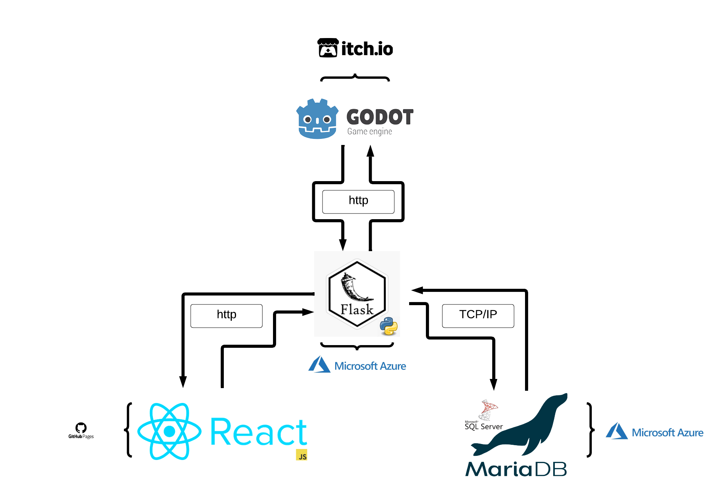

# Airport Heist

<p align="center">
    
</p>

# Page

https://Aki78.github.io/airport-heist.github.io

https://docs.google.com/presentation/d/1KQzT6HgW3f3YZGUjU3Hmdlt3Ok5fKIw4FlIvdmF3t5Y/edit#slide=id.g166b1584af2_14_1

## Contents

[Introduction](#introduction)

[Current State](#current-state)

[Vision](#vision)

- [Backstory](#backstory)
- [Setting](#setting)
- [Objective](#objective)

[Functional Requirements](#functional-requirements)

- [How the game works](#how-the-game-works)
- [Decision Tree](#decision-tree)
- [Project diagram](#project-diagram)

[Quality Requirements](#quality-requirements)

- [Preliminary requirements](#preliminary-requirements)
- [Final requirements](#final-requirements-and-goals)

[Learning Tools And Information](#learning-tools-and-information)

- [Run](#run)
- [Useful git commands](#useful-git-commands)
- [Useful bash commands](#useful-bash-commands)
- [To Do List](#to-do-list)
- [Project information](#project-info)

## Introduction

This document specifies the design for the gameplay of Airport Heist. The key developers are Aki Morooka, Khai cao,
Kiana Aghajani, Jenni Hallikas and Francesco Natanni. The Purpose of Airport Heist is to produce a fun and interactive
game, that satisfies the guidelines provided by software1. As well as producing an attractive and intuitive website that
satisfies the requirements in software2. Airport Heist is suitable for all ages.

## Current State

Our game and website are currently fully functional. Our website allows users to create a profile and compete with
other users for highest score. Users can also find a tutorial on how to play and view current weather data in the
cities they will be flying to with-in the game. When users wish to play Airport Heist they will be redirected
to our game's website. This is due to GitHub having a megabyte size limit per file.

## Vision

#### Backstory

You are a master thief, captured by the Finnish authorities on the minor charge of jaywalking.
They have no idea of your true genius though and neglect to watch over you properly.
You make a daring, yet surprisingly easy escape from Jokela Prison and are now on the run!
You need to get out of Finland A.S.A.P though as the finnish authorities will stop at nothing to bring you to justice.

Due to your expert skills you are able to steal 5,000€ from the Alepa at Helsinki Airport and commandeer a small plane.
The police, however, have been alerted of your activities and are hot on your tail.
Make it to the extraction point in portugal before interpol finds you!

#### Setting

Airport Heist is set in present-day Europe.

#### Objective

Your mission is to get to your extraction team, who are waiting for you in portugal, so they can smuggle you out of
the EU.

[Back to top](#airport-heist)

## Functional Requirements

### How the game works

Airport Heist is a single player game, where the main character aims to make it to the destination airport, before they
are captured or their money runs out.

#### Travel

The main character starts in Helsinki, Finland and must end up in Portugal. Due to the size of the plane's fuel tank
flights are limited to 800km. Players are shown the airports, with-in their 800km travel range, on a map. They must
decide their flight path themselves.

#### Evading Capture

Players can see in which city interpol is and must avoid flying to the same airport. Interpol moves from airport
to airport at random and in real time. Players must make their decisions quickly. The game is over if interpol lands 
in the same airport as the player.

#### Stealing

The main character starts the game with 5000€. Each flight cost money based on how long the flight is. Money is equal 
to points, so when the player reaches portugal their score is equal to how much money they have left. In order to 
get more money, and therefore points, players may choose to steal. Stealing is done after a player arrives at an
airport. 

[Back to top](#airport-heist)

### Decision Tree

The decision tree below show all possible decisions the player can make and the benefits of each.


<p align="center">
    
</p>

[Back to top](#airport-heist)

### Project Diagram

This diagram shows how our different files interact with each other. At the moment we are using Godot, a game
engine to run our game, python to run our backend, react for our website and SQL to store the game's data.

<p align="center">
    
</p>

[Back to top](#airport-heist)

## Quality Requirements

#### Preliminary Requirements

All helper functions created were ran through pytest to ensure proper working order.
The database was cut down, to remove a lot of unnecessary information and to make calling upon the database faster.

#### Final Requirements and Goals

    -create scoring system
    -save top 10 players in a database
    -visually pleasing user interface
    -smooth animated motion
    -short start-up time
    -30fps
    -no freezing
    -the game will be in real time, instead of turn-based
    -interpol will be trained with machine learning
    -server will be set up remotely so the game will be playable online for anyone, anywhere 

[Back to top](#airport-heist)

## Learning Tools And information

### Useful Git Commands

```bash
git pull (saves from github)

git add . (all files)
git commit -m "discription of changes" (add your changes to local git history)
git push (pushs to the repository)

git rm file_name (removes file_name)

git stash (restore everythiing to last commit)

git status (shows your current git state)

git clone repo_name (when you want to copy a repo and add it your computer)

./run_git.sh 'comment'(franks special command)
```

### Useful Bash Commands

```bash
pwd                               shows you to curent directory
cd [name of directory]            change directory
cd ~ 		                  takes you home
ls 			          list directory and files in the directory
mkdir [name of directory]         makes a directory
touch [name of file]	          creates a file in the current directory 
mv file.txt mouseless	          move file to somewhere
mv file.txt file.py	          renames file from txt to py
cd ..			          .. means back one directory

DANGER COMMANDS
rm file.py		          removes file named (only for files not directory)
rmdir			          removes empty directory only
rm -r [name of directory]         removes directory and everything in it
rm -rf name		          remove recurssive force name of directoty, must use force to delete git directory
rm *				  this will delete all files only! so make sure youre in the right directory
rm -r * 			  deletes everything in directory including other directories
rm -r *4*			  deletes everything that has a 4 in it
find . -name "*3*.py"	          find files with 3 and .py in it
find . -name "*3*.py" -delete	  find files with 3 and .py in it and then deletes it
cat main.py			  will print out whats inside the file

control-c			  stop command
py -3 filename.py		  runs python program that is in the file in your terminal (windows only)
python3 filename.py		  runs python program that is in the file in your terminal (linux/Mac)

grep -r [expression]              finds the file where the expression exists
```

[Back to top](#airport-heist)

## To-Do-List

### Khai

- [x] js react
- [x] js user login
- [x] js create user account
- [ ] flask user login with password
- [ ] js unit test (optional)
- [ ] js embedding Web Assembly (optional)

### Kiana

- [x] html/css leader board
- [ ] html/css tutorial page
- [x] html/css make mobile friendly
- [ ] html/css/js add night-mode option (optional)
- [ ] html/css/js progress graph (optional)

### Frank

- [x] flask API's leader board
- [x] flask create user account
- [x] flask fetching weather
- [ ] flask document API's (optional)
- [x] flask API unit testing (done with insomnia)

### Jenni

- [x] SQL leaderboard
- [x] SQL users
- [x] SQL update airport DB
- [ ] SQL set up DB could
- [ ] SQL user settings DB (optional)
- [ ] SQL play history (optional)

### Aki

- [x] godot game logic / dialog
- [ ] godot call game init from API's
- [x] godot make real time strategy
- [ ] flask API's for game init
- [x] flask set up python cloud
- [ ] godot better map (optional)
- [ ] godot machine learn AI (optional)
- [ ] godot add to google playstore (optional)

### All

- [x] set up server
- [ ] make presentation
- [ ] make charts
- [ ] update documentation
- [ ] test final game

[Back to top](#airport-heist)

### Project Info

https://github.com/vesavvo/Python_Ohjelmistoteema/tree/main/English/Project

https://github.com/ilkkamtk/html-css-assignment

https://www.youtube.com/playlist?list=PLKenVLUxjmH-y89AiiI2xcXDy5QG83D4K

https://github.com/ilkkamtk/JavaScript-english/blob/main/assignments.md
